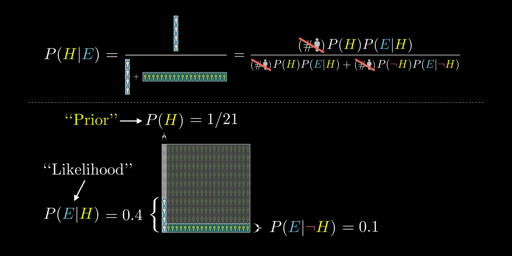

# Bayes' Theorem

Bayes' Theorem is a statistical rule for updating belief in a hypothesis based
on observation; to answer the question "how likely is my hypothesis _given_ the
observed evidence?"

$$
P(A|B) = \frac{P(B|A)P(A)}{P(B)}
$$

**Notation:** $P(X)$ is the _prior_ probability of event $X$; how likely we
believe it to be without knowing anything else. $P(X|Y)$ ("probability of $X$
given $Y$") is a _conditional_ probability; the likelihood of $X$ given that we
know $Y$ has occurred. The conditional probability relates evidence of $Y$ to
degree of belief in $X$.

When we know how likely $A$ and $B$ are on their own, and we know how to relate
evidence of $A$ to the likelihood of $B$, Bayes' theorem lets us infer the
likelihood of $A$ in light of evidence of $B$. This estimate of $P(A|B)$ is the
_posterior_ probability.

In [[8afd7ab6]], where we are interested in $argmax_{A}(P(A|B))$ (that is, only
need to compare posterior probabilities, not know their absolute values), we
observe that $P(A|B) \propto P(B|A)P(A)$, meaning we don't even need to know
$P(B)$.

From [3blue1brown]:

[3blue1brown]: https://www.youtube.com/watch?v=HZGCoVF3YvM
